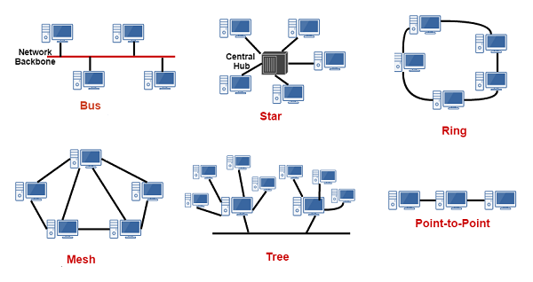

# Networks

Network Topologies  

**Point-to-point**: private connection between 2 or more devices for private services. It’s closed, so it doesn’t communicate with other devices over the Internet (everything is local, no middle-man). It’s technically the most secure network, and it theoretically shouldn’t require encryption (unless you are worried about someone tapping your lines or something). If the cord goes bad, then communication between the two connected devices is terminated.  

**Bus**: One long cable connected to each other and connects two switches together. The switches handle traffic management. The long cable is referred to as the **bus**. There is a **T-connector that** allows a third wire to connect to the two main cables. The third wire goes to an endpoint device on the network, allowing it to communicate with the rest of the network. If you are using one long cable, a **vampire tap** is connected to the wire, and then a cord connects from the tap to an endpoint device, allowing it to communicate with the rest of the network. This endpoint device is referred to as a **station**. The T-connector and vampire tap do not process data, so all traffic is sent to each device, similar to how a hub works. However, the devices ignore data sent to them unless the recipient address is their MAC address. If one of the connecting wires goes bad, then only that one device cannot communicate with the rest, and none can communicate with it. However, if the bus wire goes bad, all connections terminate.  

**Tree**: the network consists of a root device, typically being a switch or router (some device that forwards communication to other devices). It then communicates with branch devices (stepping stones, devices that assist in organizing the network and pass on traffic), which propagate the traffic to leaf devices (endpoints such as computers, printers, etc.). If a device on the network wants to communicate with another device, it sends the traffic up through the branch devices to the root device. The root device then handles the traffic. This allows for neat organization. It makes scalability nice, since devices are added as leaf devices, which won’t impact the majority of the network’s configuration. It has some redundancy (if one branch goes down, the other branches not reliant on it can still function).  

**Hub-and-Spoke, or Star**: the network consists of a central device dedicated to coordinating traffic in between devices. All other devices connect to that central device. If connection to one of the devices goes bad, the rest can still communicate with the central piece, allowing them all to communicate with each other still. However, if the central device goes down, then all connections terminate.  

**Ring**: each device on the network can communicate with two other devices. If one device needs to communicate with a device it doesn’t have a direct connection to, it passes it to one of the devices it can connect to, and that devices forwards it. It keeps going around until it reaches the requested device. If one connection is severed, a connection can still be made by looping through the network.  

**Mesh**: each device can connect with several devices at a time. No direct organization, but it is very redundant. If a connection is lost, there are several other paths that can be taken to reach the requested device.  

**Hybrid**: a combination of other topologies (tree with hub-and-spoke and point-to-point elements, for example). Less intuitive to learn off the bat, but it tailors the network needs for the company/individual.  
      