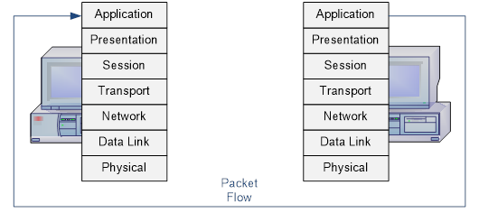

# Models

## (OSI) Open System Interconnection 

**What:** The OSI Model is a seven-layer model for networking. It describes how information moves from an application on a network device to its destination over a medium. The model outlines the seven layers, and the protocols used at those layers. 

**So-What:** It provides a way for people to standardize protocols, software, and technology communication. It makes creating easier, since improvements can be made in an isolated setting that won’t hurt other protocols or software. It makes testing easier, since it’s isolated and its focused on the specific creation. It makes debugging easier, since people can narrow down which layer, or step, the issue may be occurring in. It’s also a helpful model to teach how communication is done, as well as networking concepts in general. 

As shown in the image above, the seven layers are laid out as such:

| Layer 7 | Application |
| :---- | :---- |
| Layer 6 | Presentation |
| Layer 5 | Session |
| Layer 4 | Transport |
| Layer 3 | Network |
| Layer 2 | Data Link |
| Layer 1 | Physical |

Layers 5-7 focus on applications: interfacing for a user, formatting data, etc. Layers 1-4 focus on transporting data. When following the process of data transporting from a device to a destination device, follow the flow shown in the image. It starts at Layer 7 and moves down to Layer 1 on the first device. Then after it transports and reaches the destination, it starts at Layer 1 and goes to Layer 7\. Depending on certain scenarios and protocols in play, it could start or end at a lower level.

**Application Level**  
This is the layer closest to the end user. It provides network services to applications on the user’s device, making them able to communicate over a network. For example, when the web browser performs DNS resolution and begins to prepare reaching out to a web server, this is Layer 7\. Sending and receiving emails also starts at layer 7\. 

**Protocols used:** HTTP, FTP, SMTP/POP3 (send and receive emails), DNS, and others used by software to communicate over the network.

**Presentation Level**  
This layer specializes in translating data between the application layer and the varying formats the data may need to be in to transfer over the network. Data encryption/decryption, compression, and data translation are examples of what happens in this layer.

**Data translation** is the process of turning data from one format into another. This makes it so complex code or information can be reformatted into a standardized type of data that can be easily transferred, and then it can be restored when it reaches the target device. For example, files can be compressed using ZIP compression, becoming a zipped file and compressed for easier delivery.

**Protocols used:** SSL/TLS for encryption, 

**Session Level**  
This layer manages the connection and communication between two devices or applications. The several phases of this layer are as follows:

1. Establishes/initiates the “**session**”, or connection, between the devices/applications.  
2. Maintains the session as the devices communicate. It determines if the communication is using **half-duplex** (each endpoint takes turn sending data, back and forth), or **full-duplex** (both endpoints send and receive data at the same time). This layer will send occasional synchronization points, so if the connection is interrupted, then the communication can continue from a saved point rather than restarting the entire thing. It will also perform recovery, so data loss can be mitigated.  
3. Properly closes the session.

**Protocols used:** 

## (TCP/IP) Transmission Control Protocol/Internet Protocol