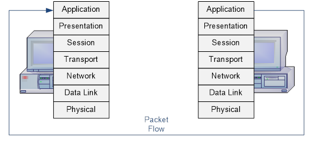

# Models

## (OSI) Open System Interconnection 

**What:** The OSI Model is a seven-layer model for networking. It describes how information moves from an application on a network device to its destination over a medium. 

This model is more of a theoretical/conceptual idea for data transmission. The TCP/IP model is a bit more of a practical application, as it focuses a bit more on specific protocols used for the data transmission.

**So-What:** It provides a way for people to standardize protocols, software, and technology communication. It makes creating easier, since improvements can be made in an isolated setting that won’t hurt other protocols or software. It makes testing easier, since it’s isolated and its focused on the specific creation. It makes debugging easier, since people can narrow down which layer, or step, the issue may be occurring in. It’s also a helpful model to teach how communication is done, as well as networking concepts in general. 

*Credit: How To Network, https://www.howtonetwork.com/network-design-workbook/networking-fundamentals/*

As shown in the image above, the seven layers are laid out as such:

| Layer | Method |
| :---- | :---- |
| Layer 7 | Application |
| Layer 6 | Presentation |
| Layer 5 | Session |
| Layer 4 | Transport |
| Layer 3 | Network |
| Layer 2 | Data Link |
| Layer 1 | Physical |

Layers 5-7 focus on applications: interfacing for a user, formatting data, setting up the connection, etc. Layers 1-4 focus on transporting data. When following the process of data transporting from a device to a destination device, follow the flow shown in the image. It starts at Layer 7 and moves down to Layer 1 on the first device. Then after it transports and reaches the destination, it starts at Layer 1 and goes to Layer 7. While hopping from device to device to reach its target, it will occasionally go up and down a couple of layers.

### Application Layer
This is the layer closest to the end user. It provides network services to applications on the user’s device, making them able to communicate over a network. For example, when the web browser performs DNS resolution and reaches out to a web server, this is Layer 7. Sending and receiving emails also starts at layer 7. 

**Protocols used:** HTTP, FTP, SMTP/POP3 (send and receive emails), DNS, and others used by software to communicate over the network.

### Presentation Layer 
This layer specializes in translating data between the application layer and the varying formats the data may need to be in to transfer over the network. Then after it's done traveling, it retranslates the data so then the application layer can use the data. Data encryption/decryption, compression, and data translation are examples of what happens in this layer.

**Data translation** is the process of turning data from one format into another. This makes it so complex code or information can be reformatted into a standardized type of data that can be easily transferred, and then it can be restored when it reaches the target device. For example, files can be compressed using ZIP compression, becoming a zipped file and compressed for easier delivery. Then it can be unzipped later.

**Protocols used:** SSL/TLS for encryption

### Session Layer  
This layer manages the connection and communication between two devices or applications. The several phases of this layer are as follows:

1. Establishes/initiates the “**session**”, or connection, between the devices/applications.  
2. Maintains the session as the devices communicate. It determines if the communication is using **half-duplex** (each endpoint takes turn sending data, back and forth), or **full-duplex** (both endpoints send and receive data at the same time). This layer will send occasional synchronization points, so if the connection is interrupted, then the communication can continue from a saved point rather than restarting the entire thing. It will also perform recovery, so data loss can be mitigated.  
3. Properly closes the session.

**Protocols used:** ISO 8327 (this protocol is what does the starting, stopping, and recovering communication sessions)

### Transport Layer
This layer focuses on the communication between the two connecting devices in question (the first source and the final destination). Data is taken from the session layer and split up into pieces called **segments**. These segments are then passed to Layer 3, the network layer. Once data is returned from layer 3, the segments are then reassembled into data, and that data is sent to the session layer.

This layer also handles flow control and error control for inter-network, or different network, communication. **Flow control** is what sets how fast the data is trasmitted from the sender to the receiver. The trasmission speed is always going to be the speed of the slower connection (this way, a fast connection won't overwhelm a slow connection). **Error control** makes sure the data received is complete. If it isn't complete, then a retransmission is issued, depending on the protocol being used.

If the protocol is using TCP (Transport Control Protocol), it will check for errors and resend any lost or corrupted packets. Then it wil re-arrange the packets back into order.

If the protocol is using UDP (User Datagram Protocol), then it prioritizes speed but disregards the connection itself and statuses. It gets the packets sent faster by not doing any checks for errors, and it does not do any handshakes or negotiations for connections. If a packet is corrupted, it does not get resent. This is popular for live services like video streaming and video games.

This layer uses ports to help direct traffic. It helps software anticipate what type of data is being sent by setting a standard for what type of data will be sent to which port, and how that data will be formatted.

**Protocols used:** TCP, UDP.

### Network Layer
This layer focuses on making sure data is transported between two different networks. It also does **routing**, which means that it finds the best physical path for the data to reach the sender to the receiver. If the devices are on the same network, then the data is sent to Layer 2, the Data Link Layer.

The segments from layer 4 are broken up into pieces called **packets** to be sent across networks. Each packet is given two sections: a header and payload. Information is put in the header to help facilitate the transfer. Then, it manages the flow of data to prevent congestion in the traffic. The structure of the header differs between IPv4 (Internet Protocol version 4) and IPv6 (Internet Protocol version 6). The payload is the data being transferred itself.

Information such as IP addresses are put into the header, so the routers know where to forward the packets to.

**Protocols used:** 
Internet Control Message Protocol (ICMP), IPsec (protocols for setting up secure encrypted connections, i.e. VPNs) 

### Data Link Layer
This layer focuses on making sure data is transferred between two devices on the same network. This could look like a device needing to reach out to its router if the final receiver is on a different network, or it could look like two devices connected directly communicating with each other, like a Local Area Network (LAN) connection.

The packets from Layer 3 that are passed down are broken up in pieces called frames. Once the frames reach the receiver, it will reform back into packets.

This layer also does some flow control and error control on the intra-network, or internal/same network.

Protocols for Layer 2: Media Access Control (MAC), Address Resolution Protocol (ARP).

### Physical Layer
This layer focuses on the physical wiring/waves that data travels across, and it converts the frames into binary (0 and 1). It's sent over cords either via electrical pulses or light (fiber optic is light). For Wi-FI, where data is sent over waves, the medium is air, and is still considered "physical", thus the air is a part of Layer 1.

Protocols: Ethernet (the cabling and pulses of binary)

## (TCP/IP) Transmission Control Protocol/Internet Protocol

**What**: This is another model that represents computers talking to each other. It's how an application can communicate to another device, and how data is sent. While the OSI model is 7 layers, the TCP/IP model is 4 or 5 layers, depending on how you break it up. 

While the OSI Model is more theoretical/conceptual, this model focuses more specifically on protocols and using the protocols to perform the data transmission.

**So-What**: This is a practical layout for people to implement protocols and get a network communicating successfully.

This can be four layers:

*Credit: AfterAcademy, https://afteracademy.com/blog/what-is-the-tcp-ip-model-and-how-it-works/*

Or five layers:

*Credit: AfterAcademy, https://afteracademy.com/blog/what-is-the-tcp-ip-model-and-how-it-works/*

I'm going to break it down into five layers and go over each one. The bottom two layers in the five-layer model are just combined into one layer for the four-layer model. 

As shown in the images above, the five layers are laid out as such:

| Layer | Method |
| :---- | :---- |
| Layer 5 | Application |
| Layer 4 | Transport |
| Layer 3 | Internet |
| Layer 2 | Data Link |
| Layer 1 | Physical |

The flow for this model is similar to the OSI model. It starts at the Application layer (layer 5), then it goes down through the layers to the physical layer (layer 1), then it goes back up the layers to layer 5 again when it reaches its destination. While hopping from device to device to reach its target, it will occasionally go up and down a couple of layers.

Here's an picture showing this flow:

*Credits: Geeks for Geeks, https://www.geeksforgeeks.org/computer-networks/tcp-ip-model/*

### Application Layer
This layer is basically Layers 5-7 of the OSI Model grouped together into one. It covers network applications communicating to devices with network services. For example, web browsers like Google Chrome or email clients like Gmail connect to the network. THe protocol for communication is determined here.

This layer handles the data formatting so then both devices communicating to each other understand the data. It also performs the encryption of the data for secure transmission

This layer also handles the session managment. Here's the breakdown for how a session is set up and functions: 

1. Establishes/initiates the “**session**”, or connection, between the devices/applications.  
2. Maintains the session as the devices communicate. It determines if the communication is using **half-duplex** (each endpoint takes turn sending data, back and forth), or **full-duplex** (both endpoints send and receive data at the same time). This layer will send occasional synchronization points, so if the connection is interrupted, then the communication can continue from a saved point rather than restarting the entire thing. It will also perform recovery, so data loss can be mitigated.  
3. Properly closes the session.

**Protocols**: HyperText Transfer Protocol (HTTP), Simple Mail Transfer Protocol (SMTP), File Transfer Protocol (FTP), Domain Name System (DNS).

### Transport Layer
This layer focuses on making sure data is sent across the network safely and in the right order, depending on which protocol for transportation is used.

The data is split up into pieces called **segments**, and then it's passed to Layer 3. Once the segments are at the final destination, the segments are reassembled.

This layer also handles flow control and error control for inter-network, or different network, communication. **Flow control** is what sets how fast the data is trasmitted from the sender to the receiver. The trasmission speed is always going to be the speed of the slower connection (this way, a fast connection won't overwhelm a slow connection). **Error control** makes sure the data received is complete. If it isn't complete, then a retransmission is issued, depending on the protocol being used.

If the protocol is using TCP (Transport Control Protocol), it will check for errors and resend any lost or corrupted packets. Then it wil re-arrange the packets back into order.

If the protocol is using UDP (User Datagram Protocol), then it prioritizes speed but disregards the connection itself and statuses. It gets the packets sent faster by not doing any checks for errors, and it does not do any handshakes or negotiations for connections. If a packet is corrupted, it does not get resent. This is popular for live services like video streaming and video games.

### Internet Layer
This layer can also be referred to as the **network layer**, similar to the OSI model's Layer 3. This layer focuses on routing data across different networks. It's about *where* the data is being sent specifically.

The segments from layer 4 are broken up into pieces called **packets** to be sent across networks. Each packet is given two sections: a header and payload. Information is put in the header to help facilitate the transfer. Then, it manages the flow of data to prevent congestion in the traffic. The structure of the header differs between IPv4 (Internet Protocol version 4) and IPv6 (Internet Protocol version 6). The payload is the data being transferred itself.

Information such as IP addresses are put into the header, so the routers know where to forward the packets to.

**Protocols**: Internet Protocol (IP), Internet Control Message Protocol (ICMP)

### Data Link Layer
This layer focuses on making sure data is transferred between two adjacent devices, which will be devices on the same network. This could look like a device needing to reach out to its router if the final receiver is on a different network, or it could look like two devices connected directly communicating with each other, like a Local Area Network (LAN) connection.

The packets from Layer 3 that are passed down are broken up in pieces called frames. Once the frames reach the receiver, it will reform back into packets.

This layer also does some flow control and error control on the intra-network, or internal/same network.

### Physical Layer
This layer focuses on the physical wiring/waves that data travels across, and it converts the frames into binary (0 and 1). It's sent over cords either via electrical pulses or light (fiber optic is light). For Wi-FI, where data is sent over waves, the medium is air, and is still considered "physical", thus the air is a part of Layer 1.

Protocols: Ethernet (the cabling and pulses of binary)