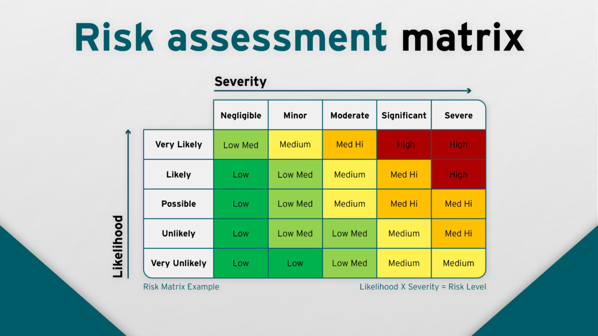

# Risk

**Risk Assessment and Threat Analysis**  
	Blue Team formulas  
		Risk \= vulnerability \* threat \* consequence  
			Vulnerability \= an exploitable item (ex: bad policy, non-updated software, weak controls)  
			Threat \= source or actor that creates the incident (ex: adversary hacker, untrained employees)  
			Consequence \= impact if threat exploits vulnerability (damage to operations, assets, individuals, interests)

		Threat level \= Attractiveness of resources / security measures in place

		Single Loss Expectancy (SLE) \= asset value \* exposure factor  
			SLE \= cost associated with a single identified risk against a specific asset

Exposure factor (EF) \= calculated loss organization suffers if specific asset was violated/compromised by an identified risk (as a percentage)

		Annualized Loss Expectancy (ALE) \= SLE \* 	annual rate of occurrence  
ALE \= estimated yearly cost for how many times an SLE occurs

Annual rate of occurrence (ARO) \= expected frequency that a specific threat/risk will occur in a year	

	Red Team formulas  
		Rewards (ideological, monetary) / cost (financial, time)  
			Higher the turn out, the more likely you could be a target  
	

Risk Management  
Identify risks  
Who, what, when, where, why that can affect ability to operate nominally (acceptable range)  
Brainstorm \- look at prior experiences, lessons learned  
Think pessimistically \- what’s the worst that can happen  
Feedback from others  
Consult with experts  
Write clear risk statements  
If X happens, then Y is the result

Risk Assessment  
Identify assets  
Information \- What are you storing?  
		Laws to protect:  
Personally Identifiable Information (PII)? General Data Protection Regulation (GDPR)

Personally Identifiable Financial Information (PIFI)? Payment Card Industry Data Security Standard (PCI DSS), Gramm-Leach-Bliley Act (GLBA)

Protected Health Information (PHI)? Health Insurance Portability and Accountability Act (HIPAA)  
		Other data:  
			Intellectual property  
			Trade secrets  
			Classified, Confidential, Top Secret information  
	How much value is that data worth (both economically and sentimentally)?  
Devices

Inventory Threats  
Risk assessment matrix  
Risk \= Likelihood x Severity of Impact  
Likelihood \= improbable, remote, occasional, probably, frequent  
Severity of Impact \= negligible, low, moderate, high, severe/critical  
	  

Identify architecture  
	Makeup of network (software, hardware, etc)

Identify controls that can be put in place  
	Tools  
	Policies  
	  
	Assess controls  
		How are they doing? Results?

	Monitor systems/controls

Document the following:  
Detailed evaluation of assets (who, what, how many)  
List of all threats (that you can)  
List of risks, rate of occurrence, extent of realized losses  
Controls in place

Risk Response  
Reduce/Mitigate \- implement controls to reduce the likelihood or impact of an incident.  
Assign/Transfer \- place cost of loss onto another entity/organization. Some tools such as AWS will share responsibility for securing their service.  
Accept \- Intentionally accepting the risk and consequences. This could be chosen if the impact of a risk is less than the cost of mitigation, or the probability of the risk is really remote.  
Deter \- implement deterrents (cameras, guards, audits)  
Avoid \- change activities/location to lower/remove risk. Ensure there is a zero chance of a risk occurring (ex: shutting down USB ports so compromised USBs will not work.  
Reject/Ignore \- unacceptable, never do this (though some unknown unknowns will be present and will thus meet this category

Get insurance